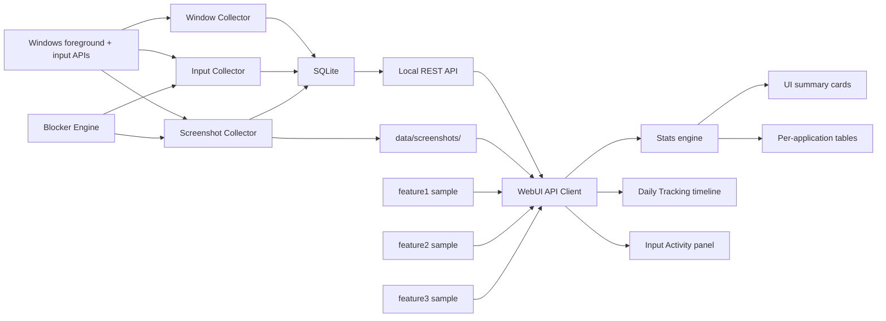

# MVP Information Flow

This document explains how information moves through the live collector MVP and how that path maps to the future local recorder infrastructure.

## Current Flow

The current MVP has a real local backend with four subsystems: a window collector, a keyboard input collector via Raw Input, a screenshot collector with idle detection, and a blocker/filter engine. The Rust collector writes SQLite rows and JPEG files, exposes JSON over a local REST API, serves screenshot images as static files, and the WebUI renders descriptive statistics, keyboard input activity, and a daily screenshot timeline.

## Step Details

Window Collector (Feature 1):

- `sample-once` reads the current foreground window.
- `record` writes focus changes for a bounded period.
- `serve` runs the polling collector and local REST API in one process.
- Polls `GetForegroundWindow` at configurable intervals (default 1000ms).
- Deduplicates: writes only when foreground window identity changes.

Screenshot Collector (Feature 3):

- Runs in a background tokio task alongside the window collector loop.
- Captures every 60s, but only when the user is active (keyboard/mouse input within the last 2 minutes, via `GetLastInputInfo`).
- Uses `xcap` (Windows Graphics Capture API) to capture the primary monitor.
- Resizes to max 640px width and encodes as JPEG.
- Writes files to `data/screenshots/YYYY-MM-DD/HH-MM.jpg`.
- Metadata (timestamp, file path, dimensions, foreground app/window) is stored in the `screenshot_thumbnails` table.
- Checks blocker config before capture — blocked apps/windows are never screenshotted.

Input Collector (Feature 2):

- Runs in a dedicated background thread using Raw Input API.
- Creates a message-only window (`HWND_MESSAGE`) with `RIDEV_INPUTSINK` for system-wide keyboard events.
- Maps virtual-key codes to characters via `ToUnicodeEx` using the foreground window's keyboard layout.
- Buffers keydown/keyup events into text segments, flushing on Enter (VK_RETURN) or after 30s idle timeout.
- Tracks backspace (pop from buffer) and delete (increment counter) per segment.
- Cross-thread communication via `tokio::sync::mpsc::unbounded_channel` (Raw Input thread to async drain task).
- Known limitation: Raw Input cannot capture composed IME characters (Chinese/Japanese). Feature 2B will add a WH_GETMESSAGE hook DLL.

Blocker Engine:

- Loads rules from `collector/blocker_config.json` at startup.
- Supports `screenshot` and `text_capture` capture types (forward-looking).
- Matches on `process_name`, `window_title`, or `exe_path_hash`.
- Operators: `equals`, `contains`, `starts_with`.
- Blocked capture attempts are logged to the `blocker_hits` table.

Storage:

- SQLite stores append-only `raw_events`, `window_events`, `screenshot_thumbnails`, `input_events`, `text_segments`, and `blocker_hits`.
- Raw event payloads preserve the sampled window snapshot as JSON.
- Screenshot image data lives on the filesystem; SQLite stores only metadata and file paths.
- The open interval is derived at query time and has no `endedAt` until the next focus event.

API:

- `/api/health` — full collector health (status, uptime, per-subsystem state, DB row counts).
- `/api/window-events` — raw joined focus events.
- `/api/time-events` — interval-shaped records for the WebUI.
- `/api/blockers` — blocker rules and recent hits.
- `/api/screenshots` — screenshot metadata for a given date.
- `/api/screenshot-summary` — aggregated stats (count, hours, top apps).
- `/api/input-events` — raw keyboard input events.
- `/api/input-summary` — aggregated input stats (events, keydown/keyup, segments, chars, top apps).
- `/api/text-segments` — text segments with content and edit stats.
- `/screenshots/` — static file serving for captured thumbnail images.

Descriptive stats engine:

- Computes row count, total duration, mean, median, standard deviation, min, max, Q1, and Q3.
- Groups durations by application/process.
- Produces display-ready summaries without changing the original records.

Daily Tracking timeline:

- Groups screenshots by hour.
- Shows thumbnail, timestamp, and foreground app/title for each capture.
- Click-to-expand for full-size view.
- Summary bar shows total screenshots, hours covered, and top apps by screenshot count.

Input Activity panel:

- Summary cards show total events, keydown/keyup counts, segments, total characters, and last activity time.
- Per-application character bar chart.
- Expandable text segments table with text content, edit stats (backspace/delete), and foreground app context.

UI cards/tables:

- Cards show global metrics at a glance.
- Tables show per-application active duration and event counts.
- Tab bar switches between Statistics (Feature 1), Input Activity (Feature 2), and Daily Tracking (Feature 3) views.
- Collector Monitor panel replaces the old Collector Connection panel with real-time subsystem health and DB row counts.
- Both views support sample data fallback and live collector data.
- Validation output should be visible and actionable for bad API payloads or empty collector responses.

Future recorder pipeline:

- Event-driven `SetWinEventHook` can replace or augment window polling.
- Feature 2 (text capture) is implemented on Raw Input; Feature 2B (IME/hook) can use the same blocker engine and session infrastructure.
- A bounded event bus will decouple collectors from storage.
- Derived rollups can be persisted for faster queries.
- Server-Sent Events or WebSocket streaming can push live focus changes.

## Current MVP vs Future Infrastructure

Current WebUI owns:

- REST client for `/api/time-events`, `/api/input-events`, `/api/input-summary`, `/api/text-segments`, `/api/screenshots`, and `/api/screenshot-summary`.
- Built-in sample fallbacks (feature1, feature2, and feature3).
- Descriptive statistics.
- Per-application summaries.
- Daily screenshot timeline.
- Tab-based view switching.
- Static UI rendering.

Current collector/storage owns:

- Windows foreground-window polling.
- Raw Input keyboard capture with text segment reconstruction.
- Periodic screenshot capture with idle detection.
- Blocker/filter engine with JSON config.
- Raw event creation, including `window_focus` events.
- Screenshot thumbnail generation and file storage.
- Capture status handling for lock screen, UAC, permission errors, and unavailable windows.
- SQLite WAL storage (6 tables).
- Interval generation from raw events.
- Local REST JSON API + static file serving for the WebUI.

Boundary rules:

- The UI should not call Windows APIs directly.
- Browser UI access should use the local `/api` proxy or a future same-origin shell; the collector must not expose permissive CORS for private activity data.
- The WebUI API client should accept recorder query data without knowing how it was captured.
- Raw events and derived rollups should remain reproducible; do not overwrite raw source rows during analysis.
- Privacy-sensitive fields, especially window titles and screenshots, must be optional and redaction-friendly.
- Screenshot files are served from the collector process; the WebUI does not access the filesystem directly.
